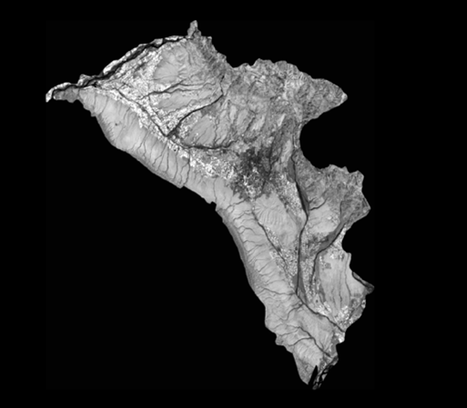
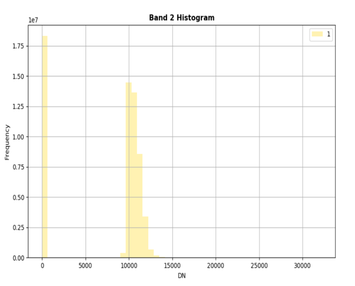

# 🌿 VegIndex_Toolset

**VegIndex_Toolset** is an open-source Python-based graphical tool designed for quick and intuitive vegetation health analysis using high-resolution **multispectral UAV imagery**. It allows **both technical and non-technical users** to compute key vegetation indices such as **NDVI**, **GNDVI**, and **SAVI**, along with **image statistics and visualization tools**.

---

## Features

-  **NDVI, GNDVI, and SAVI** calculation from multispectral UAV images  
-  **Graphical User Interface (GUI)** for ease of use  
-  **Histogram** visualization of individual bands  
-  **Image statistics** (mean NDVI, band count, band ratios, etc.)  
-  **Open-source & accessible** to researchers, farmers, and agronomists  
-  Designed for **quick field insights**, **prescription map generation**, and **crop health monitoring**

---

## Motivation

Agriculture is one of the primary sectors benefiting from rapidly advancing **Unmanned Aerial Remote Sensing**. UAVs offer **superior spatial resolution** compared to satellite systems, enabling **precision agriculture** through pixel-level crop health analysis.

Despite this potential, **open-source computational tools for UAV-based vegetation monitoring** remain scarce.

**VegIndex_Toolset bridges this gap.**

---

## Sample Outputs

### NDVI Visualization  


### Histogram of Green Band  


---

## Vegetation Index Formulas

1. **Normalized Difference Vegetation Index (NDVI)**  
   \[
   NDVI = \frac{(NIR - Red)}{(NIR + Red)}
   \]

2. **Green Normalized Difference Vegetation Index (GNDVI)**  
   \[
   GNDVI = \frac{(NIR - Green)}{(NIR + Green)}
   \]

3. **Soil Adjusted Vegetation Index (SAVI)**  
   \[
   SAVI = \frac{(NIR - Red)}{(NIR + Red + L)} \times (1 + L), \quad \text{where } L = 0.5
   \]

---

## GUI Functions

Once loaded with a multispectral image, the GUI allows users to:

- Select individual bands and visualize histograms  
- Compute NDVI, GNDVI, and SAVI  
- View statistical summaries (mean, standard deviation, etc.)  
- Export vegetation index images  
- Perform **band ratio analysis** and **count bands**

---

## Why This Tool Matters

This toolset highlights the **need and effectiveness of vegetation indices** for:

- Tracking **crop stress**  
- **Precision farming**  
- **Field scouting** and **agronomic decisions**

It combines **research-backed algorithms** with **user-friendly design** to bring remote sensing insights to the fingertips of farmers and analysts alike.

---

## Getting Started

1. Clone this repository:
   ```bash
   git clone https://github.com/vaibhavov/VegIndex_Toolset.git
